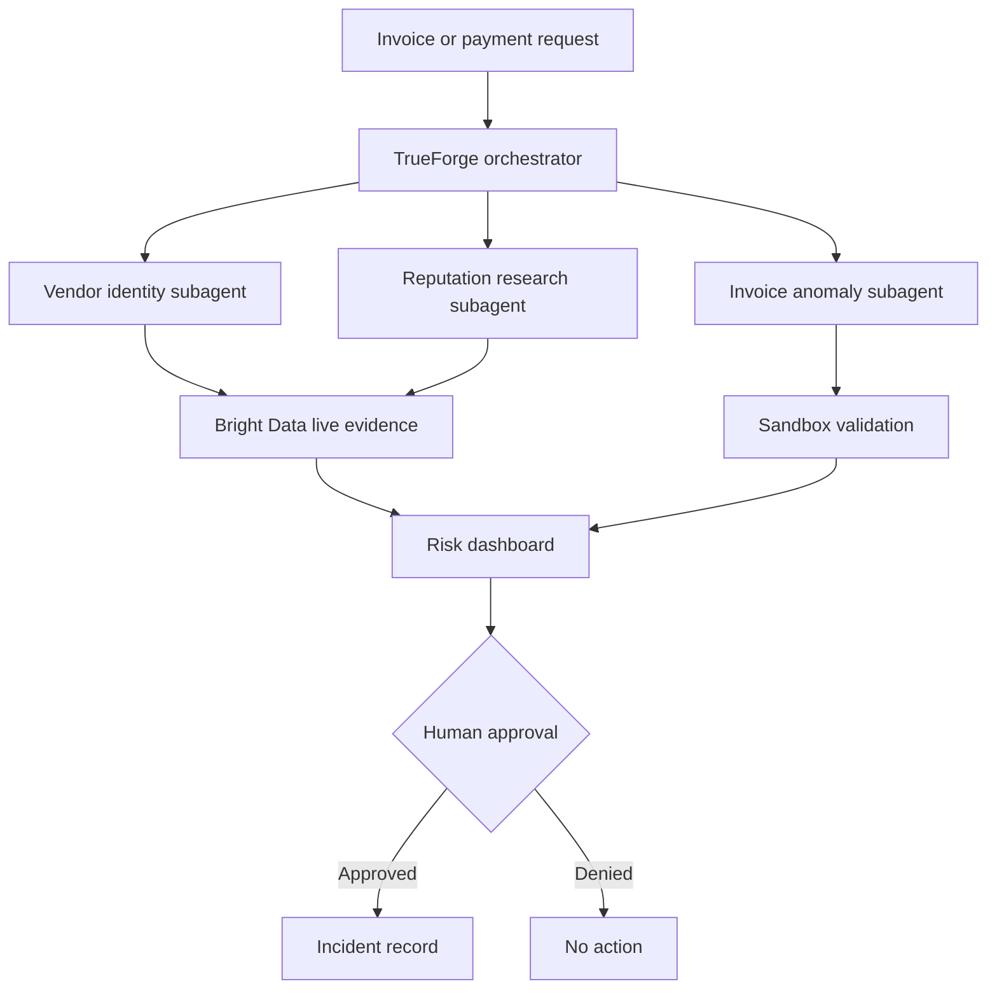

# BeforeYouPay

> An AI accounts-payable investigator that checks suspicious invoices before money leaves the company.

BeforeYouPay uses live web evidence, parallel AI investigators, sandboxed validation and human approval to help businesses detect invoice fraud and payment mistakes.

## Why this matters

Businesses repeatedly receive:

- fake invoices
- altered banking instructions
- lookalike vendor domains
- duplicate or incorrect charges
- urgent requests designed to bypass normal verification

A busy employee may approve one of these requests before noticing the warning signs. BeforeYouPay creates a verification checkpoint before payment.

## What it does

Given an invoice or payment request, the agent:

1. Extracts the vendor, sender domain, amount, line items and payment instructions.
2. Launches parallel subagents for:
   - vendor identity verification
   - invoice anomaly analysis
   - current vendor reputation research
3. Uses Bright Data to collect current public-web evidence.
4. Uses sandboxed execution to validate arithmetic and create review artifacts.
5. Produces a HIGH, MEDIUM or LOW risk assessment with cited evidence.
6. Pauses for explicit human approval before creating an incident record.
7. Acts only after approval and records exactly what it created.

## Demo result

The fictional demonstration invoice received a **HIGH risk score of 94/100**.

The agent discovered:

- `ad0be-renewals.com` used a zero to impersonate Adobe
- no public evidence connected the sender domain to Adobe
- banking instructions had supposedly “recently changed”
- the message demanded an urgent wire transfer
- it discouraged contacting the usual account manager
- the stated total exceeded the calculated total by **$206**

The agent recommended **DO NOT PAY**, requested human approval and then created two sandboxed artifacts:

- [Generative UI investigation dashboard](payment_investigation_dashboard.openui)
- [High-risk payment incident record](high_risk_payment_incident_record.json)

## Why this is an agent—not a chatbot

A chatbot could explain common invoice scams. BeforeYouPay performs the investigation:

- reaches live public-web sources through Bright Data
- delegates three investigations to parallel subagents
- runs validation and creates files in a sandbox
- maintains the investigation across multiple turns
- displays its tool activity and reasoning trace
- pauses before consequential action
- resumes only after a human approves

## Architecture

## Disclaimer

BeforeYouPay is a hackathon prototype. It supports—but does not replace—professional financial, legal, or cybersecurity review.

## Disclaimer

BeforeYouPay is a hackathon prototype. It supports—but does not replace—professional financial, legal, or cybersecurity review.
